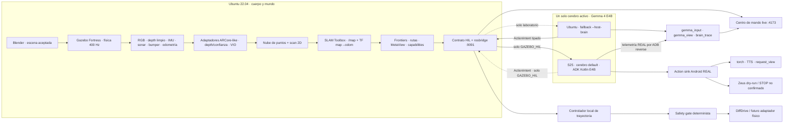
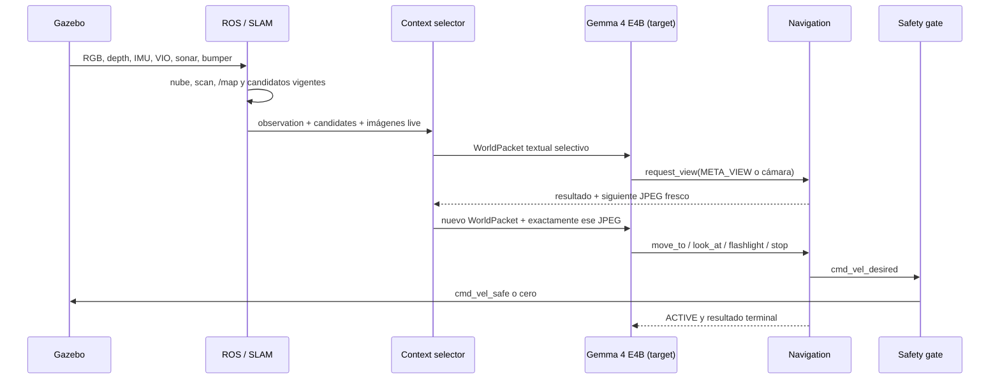
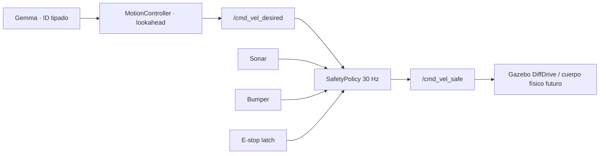

# PULSO — arquitectura ejecutable de extremo a extremo

Estado del documento: 2026-08-01. Este texto distingue la decisión de producto
del código y la evidencia presentes; no convierte un target en una función
terminada.

## 1. Qué es PULSO

PULSO es un cerebro local de búsqueda y rescate montable sobre un rover. En el
corte actual, Gazebo simula el entorno, el cuerpo OpenBot y un Samsung S25 Ultra
fijo en horizontal. ROS 2 convierte sensores en mapa, candidatos y reflejos de
seguridad. **Gemma 4 E4B es el cerebro objetivo de producto** para decidir qué
evidencia pedir y qué candidato físicamente válido usar. E4B ya pasó un perfil
nativo y el E2E estricto de simulación; E2B se mantiene únicamente como
baseline histórico del arnés. El APK y el hash E4B se verifican en el preflight
de `pulso real`. El cerebro S25 ya ejecutó un ciclo HIL real; `ANDROID_REAL`
integra los sensores y actuadores, pero ARCore `TRACKING`, nube, térmica y
calidad sensorial sostenida siguen sin verificarse.
YOLO11n-pose solo propone pistas visuales; no confirma personas.

La regla de arquitectura es esta:

> Simulación y hardware cambian los adaptadores de sensores y cuerpo, no el
> significado de las observaciones, candidatos, herramientas ni resultados.

La simulación no se declara físicamente idéntica al mundo real. Sí conserva el
contrato, los marcos, la frescura, la incertidumbre y los estados de fallo que
consume el cerebro.

## 2. Estado real por componente

| Componente | Estado respaldado por el repositorio |
| --- | --- |
| Escena Blender, mallas visuales y colisiones | Implementado y exportado a Gazebo |
| OpenBot + S25 horizontal + ruedas + masa + sensores | Implementado en SDF/URDF |
| RGB, depth, IMU, sonar, bumper y linterna simulados | Implementado |
| Depth con huecos/confianza y VIO degradado | Implementado por adaptadores ROS |
| Nube densa, puntos VIO, scan y SLAM incremental | Implementado |
| Frontiers, rutas A–F, MetaView y control local | Implementado |
| Safety gate independiente | Implementado y probado con reglas deterministas |
| Gemma 4 E4B nativo en Ubuntu | Artefacto/hash verificados; GPU warm 11,666 ms, inferencia 1,518 ms y `move_to` correcto en perfil acotado |
| Gemma 4 E2B nativo en macOS/Ubuntu | Baseline anterior implementado en `apps/pulso-brain-host`; evidencia preservada, no valida E4B |
| Gemma 4 E4B + ADK en APK | APK/modelo verificados; inferencia HIL S25 observada, térmica sostenida y sensores físicos aún pendientes |
| YOLO11n-pose en Ubuntu CUDA y S25 CPU | Implementado; mismo contrato de saliencia, no diagnóstico |
| Centro de mando web live + MetaView 3D | Implementado; solo observa, no manda acciones |
| Captura E2E read-only con E2B | Baseline `ok=true`: Gemma→MOVE_TO→REQUEST_VIEW→JPEG auditado, sin publicar mocks |
| Captura E2E read-only con E4B | `ok=true`: 8 WorldPackets, 2 movimientos exitosos y 2 vistas auditadas, sin mocks |
| S25 como cerebro de `sim` | Default único; E4B GPU warm 11.385 s y ciclo HIL 56.937 s total, incluida espera de acción |
| Acción HIL S25 | ID canonicalizado; `MOVE_TO` aceptado; SafetyGate bloqueó por obstáculo |
| S25 `ANDROID_REAL`: RGB/Depth/VIO/IMU/torch/TTS | Implementado; APK/modelo/cámara/bridge verificados, `TRACKING`/nube pendientes |
| Zeus dry-run/STOP | Implementado; STOP no tiene ACK y no se afirma confirmado |
| Locomoción Zeus | Bloqueada; no se debe inferir del simulador ni del dry-run |

## 3. Flujo completo



Solo debe existir **un comandante cognitivo**. `./pulso sim` usa el S25 por
defecto; el host Ubuntu requiere `--host-brain` y es solo fallback de
laboratorio. Nunca deben coexistir. El bridge REAL es observacional y
deny-by-default: acepta
solo telemetría del phone para Mission Control, sin services/actions ni
`/pulso/hil/action_intent`.

El host nativo Ubuntu puede arrancar antes que ROS. Reintenta rosbridge con backoff
acotado sin descargar el engine. Una desconexión invalida observation,
candidatos, capabilities, imágenes y vista solicitada; conserva únicamente
engine y memoria compacta. Después de reconectar exige contratos nuevos antes
de decidir.

## 4. Del mundo a una decisión



Gemma no recibe continuamente la nube de puntos ni el `WorldState` completo.
Recibe texto reducido y, únicamente después de `request_view`, un JPEG de
MetaView o de cámara. Tanto el host nativo como el runtime S25 publican una copia
auditable de esa entrada en `/pulso/hil/gemma_input` y el JPEG byte a byte en
`/pulso/hil/gemma_view/compressed`.

## 5. Percepción espacial

### Pose, VIO y TF

Una **pose** es posición más orientación. VIO —odometría visual-inercial—
combina cámara e IMU para estimar cómo se movió el teléfono. En simulación,
`pulso_arcore_emulator` usa verdad de Gazebo únicamente dentro del emulador para
producir una estimación con ruido, deriva y estados `TRACKING`, `LIMITED` o
`LOST`. El cerebro y el panel no reciben la verdad privada
`/pulso/sim/ground_truth/**`.

El árbol mínimo es:

```text
map → odom → base_footprint → base_link
                           ├─ phone_mount → camera / IMU
                           ├─ sonar_front_link
                           └─ bumper_link
```

- `odom` mantiene continuidad local.
- `map` incorpora las correcciones del SLAM.
- `tracking_epoch` cambia cuando una pérdida/relocalización puede invalidar la
  geometría anterior.

### Depth, nube, scan y SLAM

1. La cámara de profundidad de Gazebo produce una imagen limpia a 15 Hz.
2. El emulador genera raw depth en milímetros, depth suavizado y confianza.
3. `cloud_adapter` reconstruye la nube densa y puntos visuales dispersos.
4. `pointcloud_to_laserscan` recorta la nube a la altura útil del rover y crea
   un scan de ±1.20 rad, 0.10–5 m.
5. SLAM Toolbox integra scan + VIO en una grilla de ocupación de 5 cm/celda.

El mapa comienza pequeño y crece con lo observado; PULSO no conoce el entorno
antes de recorrerlo.

### Frontiers y rutas

Una **frontier** es el borde entre espacio libre observado y espacio todavía
desconocido. El planificador:

- infla obstáculos 0.10 m;
- descarta rutas no alcanzables con A*;
- descarta frontiers cuyo recorrido sea menor que 0.18 m;
- calcula longitud, riesgo y ganancia de información;
- publica hasta seis alternativas, mostradas como A–F;
- usa IDs estables por cubos de 25 cm;
- emite una capability opaca y de vida corta para cada candidato.

Gemma elige un ID; no inventa coordenadas. El guard valida capability,
`navigation_revision`, `tracking_epoch`, revisión del target y vencimiento
antes de mover el rover.

Para `MOVE_TO`, el controlador declara éxito solo cuando termina a no más de
0.10 m del objetivo **y** la odometría registra al menos 0.05 m de traslación
real. Son condiciones distintas: 0.18 m filtra propuestas demasiado cercanas,
0.10 m es tolerancia final y 0.05 m evita contar como movimiento una aceptación
sin desplazamiento.

### `sensor_map_seq`, `navigation_revision` y `world_seq`

- `sensor_map_seq`: avanza con cada grilla que recibe navegación. Puede cambiar
  por crecimiento mínimo del mapa.
- `navigation_revision`: cambia cuando el conjunto/capability de candidatos
  vigentes cambia. Una acción debe estar ligada a esa revisión.
- `world_seq`: secuencia del estado que seleccionó el host cognitivo. Puede
  avanzar por observación, navegación, imagen pedida o resultado de herramienta.

Un nuevo punto de profundidad no invalida por sí solo una decisión; la invalida
un cambio material que produzca nueva revisión o epoch.

## 6. MetaView

MetaView es evidencia espacial derivada solo de `/map`, TF, scan, depth e IDs
de candidatos. No usa etiquetas de Blender ni una cámara divina del simulador.

Tiene dos representaciones del mismo estado:

- **2D autoritativa**: JPEG 800×800 que también puede consumir Gemma.
- **3D interactiva del operador**: contrato JSON con ocupación 2.5D, nube depth
  verdadera en Z, rutas y rover. Permite orbitar/panear/zoom sin reenviar una
  cámara a ROS ni cambiar el plan.

La escena 3D publica como máximo 4,500 puntos libres, 4,500 ocupados y 1,600
puntos depth por frame. Las celdas desconocidas se omiten. Las celdas ocupadas
se levantan solo unos centímetros para legibilidad: eso no afirma altura de
pared. Solo los puntos depth transformados por TF contienen Z medida.

| Elemento | Significado |
| --- | --- |
| Azul intenso | Suelo libre ya observado |
| Naranja/rojo con borde luminoso | Ocupación/obstáculo |
| Cian | Frontier |
| Polígono amarillo transparente | Campo de depth observado ahora |
| Triángulo verde con eje blanco | Rover y heading |
| A amarilla, B magenta, C cian, D naranja, E verde, F azul claro | Rutas candidatas en orden vigente |
| Aro blanco | Candidato seleccionado |
| Retícula | 0.5 m; líneas mayores cada 1 m |

`MAP` es el `sensor_map_seq`; `NAV` es la revisión de navegación; `OBSERVED`
es el área de celdas conocidas. La flecha `MAP +Y` del panel es el eje del
mapa, no norte geográfico.

## 7. Cognición y contexto

### WorldState

`WorldState` es el estado canónico fuera del modelo: pose, VIO, batería,
linterna, rango, misión, objetivo, hipótesis, targets, candidatos, obstáculos y
referencias a artefactos. En Android está definido en
`domain/WorldState.kt`; el host nativo mantiene el corte equivalente en
`pulso_brain_host/state.py`.

### CognitiveBrief

Es un resumen determinista del presente: misión y goal, pose/confianza, VIO,
batería, linterna, rango, último resultado, pistas humanas e hipótesis
relevantes. Expone por separado la condición de éxito de la misión raíz, la del
subobjetivo activo y los IDs de evidencia actuales. No es memoria libre ni
razonamiento oculto.

### MissionCheckpoint

Es memoria compacta que sobrevive a la reducción del contexto: hallazgos
durables, alternativas rechazadas y preguntas pendientes ligadas al objetivo.
En el host nativo se conserva en memoria del proceso; reiniciar el host la borra.
La persistencia Room/SQLite descrita en la arquitectura cognitiva es diseño
futuro, no comportamiento del corte actual.

### WorldPacket

Es la única entrada dinámica al modelo. Filtra por necesidad de decisión,
vigencia y relevancia; entrega como máximo cinco candidatos. Nunca incluye
capabilities opacas en el texto. El ejecutor conserva esas capabilities fuera
del modelo y las agrega solo al `ActionIntent` validado.

### Skills por demanda

El system prompt solo enumera ID y cuándo sirve cada skill:

- `survivor_inspection`
- `darkness_recovery`
- `vio_recovery`

`load_skill` devuelve su procedimiento al modelo para ese flujo; no mueve el
robot. El resultado puede compactarse después en checkpoint. Que una skill
figure `loaded` o `active` no implica que una acción física haya ocurrido.

### Context rot

Android usa `includeContents = NONE`, un WorldPacket nuevo por ciclo y vistas de
un solo turno. El host nativo mantiene caliente únicamente el engine: crea una
conversación nueva por turno, la reutiliza dentro de ese turno para los tool
results y la cierra al terminar. Publica el conteo de contexto cuando LiteRT lo
expone y mantiene la memoria durable separada. En ambos casos se evita enviar
continuamente sensores densos o una historia completa.

## 8. Gemma, herramientas y trazabilidad

Herramientas actuales:

| Tool | Responsabilidad |
| --- | --- |
| `move_to` | Elegir un `FRONTIER`/`VIEWPOINT` vigente; el controlador calcula ruedas |
| `look_at` | Centrar un target/viewpoint rotando el chasis |
| `request_view` | Pedir MetaView o cámara fresca; la imagen llega en el siguiente packet |
| `stop_motion` | Detener movimiento sin declarar terminada la misión; Zeus reporta STOP no confirmado |
| `set_flashlight` | Cambiar luz y esperar estado confirmado |
| `set_mission_focus` | Cambiar goal persistente en Android |
| `load_skill` | Cargar información procedural, sin actuar |
| `complete_mission` | Cerrar la misión raíz por decisión de Gemma, anclada a IDs/evidencia vigentes |

La misión raíz y el goal no son equivalentes. Gemma puede terminar un goal y
crear otro; alcanzar un frontier, observar una persona o verificarla son hitos.
Solo un `complete_mission` aceptado detiene el loop. El gate determinista no
decide la suficiencia semántica: valida que la decisión de Gemma use la misión,
el goal y evidencia actualmente conocidos, y después ordena STOP.

La traza pública muestra `CONTEXT`, `TOOL_REQUEST`, `TOOL_RESULT`,
`MODEL_RESPONSE`, `CYCLE_COMPLETE`, `CANCELED` y `ERROR`. Eso permite reconstruir la cadena
observable **entrada → decisión → acción → resultado**. No se publica
chain-of-thought, canales privados ni texto interno del modelo.

Para auditar exactamente la frontera pública del runtime Gemma activo:

- `gemma_input` contiene texto exacto, system prompt, schemas, tool results,
  hashes y orden del contenido;
- `gemma_view/compressed` contiene el JPEG exacto cuando hubo imagen;
- el SHA-256 enlaza ambos;
- `brain_trace` contiene solo el resumen público para el operador.

En Android esa frontera es `Content` + `Instruction` + declaraciones ADK; su
tokenización/lowering interno no es observable. En el host es la llamada nativa de
LiteRT-LM. El panel no afirma ver una serialización privada que la API no
expone.

## 9. YOLO11n-pose

El mismo `yolo11n_pose.onnx` tiene dos hosts:

- en la simulación, `pulso_person_perception` corre en Ubuntu con ONNX Runtime
  GPU y prefiere `CUDAExecutionProvider`;
- en la app, el S25 ejecuta ONNX Runtime Android sobre CPU.

Ambos producen el mismo contrato de pistas: bounding box, score, bearing,
keypoints visibles y revision, además de telemetría de provider/latencia. Es un
**sensor de saliencia**: ayuda a decir “mira allí”. No decide si hay una víctima,
lesión, atrapamiento ni estado de conciencia. Ausencia de detección tampoco
prueba ausencia de persona.

El nodo Ubuntu permite validar todo el vertical slice sin depender del S25. En
hardware, debe detenerse ese productor y quedar solo el detector Android para
no mezclar dos revisiones semánticas. El host nativo no ejecuta YOLO: consume
las pistas publicadas por el detector activo.

## 10. Movimiento y seguridad



Reglas implementadas:

- detener a `≤ 0.18 m`;
- reducir velocidad entre `0.18–0.45 m`;
- detener si el comando envejece más de `0.35 s`;
- detener si sonar o bumper no actualizan en `0.75 s` durante avance;
- limitar a 0.32 m/s y 1.6 rad/s;
- un veto `NEAR_FIELD_OBSTACLE` sostenido 1.5 s termina la acción como
  `BLOCKED`;
- el candidato bloqueado entra en cooldown 20 s;
- `E-stop` queda enclavado hasta reiniciar el nodo de seguridad.

Gemma no puede sobreescribir estas reglas. En hardware real todavía se requiere
repetir el watchdog y el E-stop en el microcontrolador; la seguridad ROS no
reemplaza una parada eléctrica.

## 11. Dos hosts cognitivos, una sola interfaz

La interfaz cognitiva permaneció estable durante la migración de modelo, pero
la identidad del modelo forma parte de la evidencia. Las trazas E2B siguen
separadas de las nuevas trazas E4B.

### Host nativo Ubuntu

`apps/pulso-brain-host` usa `litert-lm-api==0.13.1` y un engine caliente. Crea
una conversation limpia por turno y ejecuta herramientas manualmente para
conservar el guard, esperar resultados terminales y publicar la entrada
auditable. Es la ruta directa para demostrar Gemma real contra toda la
simulación sin depender de la UI del teléfono.

El perfil E4B preservado usa el artefacto de 3,659,530,240 bytes y SHA-256
`0b2a8980ce155fd97673d8e820b4d29d9c7d99b8fa6806f425d969b145bd52e0`:
GPU warm en 11,666 ms, inferencia en 1,518 ms y `move_to` tipado correcto. Es un
perfil de una decisión, no p50/p95 sostenido. El pase E2B de 3225 ms permanece
en proveniencia únicamente como baseline histórico.

### S25

`apps/pulso-android` usa ADK Kotlin + LiteRT-LM. Intenta GPU y cae a CPU si la
inicialización GPU falla; mantiene Gemma cargado hasta `CERRAR MISIÓN`. También
ejecuta YOLO y proyecta WorldState/WorldPacket. Puede recibir `GAZEBO_HIL` o
capturar `ANDROID_REAL` mediante ARCore/IMU. El APK de entrega se identifica por
el tamaño y el SHA-256 fijados en `infra/ubuntu/versions.env`, no solo por su
nombre. El preflight verifica su hash y el del modelo en el S25;
todavía falta evidencia de carga/inferencia y sensores físicos runtime.

### Estado de promoción E4B

La promoción de simulación está satisfecha con evidencia enlazada de:

1. artefacto exacto, tamaño, SHA-256 y revisión upstream;
2. carga real y perfil de decisión en GPU;
3. `model_id=gemma-4-E4B-it.litertlm` en la telemetría;
4. E2E read-only nuevo con movimientos, vistas frescas y hashes coincidentes;
5. APK E4B exacto.

Queda abierto el gate runtime independiente: carga/ciclo E4B, latencia,
temperatura y calidad sensorial medidas en el S25. Código y tests no satisfacen
ese gate.

### Paso a hardware

`ANDROID_REAL` reemplaza en código:

1. RGB/depth/VIO/IMU simulados por Camera/ARCore/IMU del S25;
2. luz/audio simulados por torch Camera2 y audio/TTS Android.

El cuerpo Zeus no reemplaza todavía DiffDrive: su transporte permanece en
dry-run y solo intenta STOP no confirmado. La locomoción física sigue fuera del
vertical aceptado.

No deben cambiar el WorldPacket, las tools tipadas, resultados terminales,
traza pública ni safety invariant.

## 12. Fuentes canónicas dentro del repositorio

- Mundo/sensores: `sim/ros2_ws/src/pulso_gazebo/worlds/pulso_disaster.sdf`
- Lanzamiento: `sim/ros2_ws/src/pulso_gazebo/launch/pulso_sim.launch.py`
- SLAM: `sim/ros2_ws/src/pulso_gazebo/config/slam_toolbox.yaml`
- Navegación/MetaView: `sim/ros2_ws/src/pulso_navigation/pulso_navigation/`
- Seguridad: `sim/ros2_ws/src/pulso_safety/pulso_safety/`
- Contratos: `contracts/` y `docs/simulation/SENSOR_CONTRACT.md`
- Brain nativo Ubuntu: `apps/pulso-brain-host/`
- Brain S25: `apps/pulso-android/`
- System prompts reales:
  `apps/pulso-brain-host/pulso_brain_host/prompts.py` y
  `apps/pulso-android/app/src/main/java/com/pulso/app/runtime/PulsoSystemPrompt.kt`
- Panel: `apps/pulso-mission-control/`

La guía para arrancar y leer cada pantalla está en
[`PULSO_OPERATOR_MANUAL.md`](PULSO_OPERATOR_MANUAL.md).
