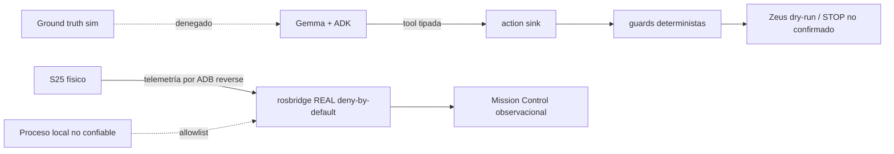

# Pulso — threat model y frontera física

Estado: simulación supervisada habilitada; `ANDROID_REAL` implementado pero
pendiente de validación runtime; locomoción Zeus bloqueada.

## Fronteras de confianza

Gemma no publica velocidad. Las tools reciben IDs/revisiones vigentes; los
actuadores y safety conservan autoridad. Mission Control no manda acciones.

## Controles implementados

| Riesgo | Control | Riesgo residual |
| --- | --- | --- |
| Coordenada/target inventado | IDs, revisions, epochs y capabilities tipadas | recalibrar TTL con latencia S25 medida |
| Imagen stale | `request_view` espera frame posterior y conserva timestamp/hash | validar sincronía ARCore runtime |
| Sensor ausente | no se fabrica RGB/depth; estados degradados explícitos | medir calidad real |
| Sobretemperatura | pausa a 42 °C y reanudación acotada | validar lectura/termal S25 |
| Fuga de imagen/audio | cómputo local, buffers cortos; PCM crudo no persistido | definir retención/export |
| Bridge usado como mando | loopback, topics allowlisted, services/actions vacíos; REAL excluye action intent | allowlist no autentica proceso local |
| Movimiento Zeus accidental | dry-run default, arm gate, operator/dead-man interlock, TTL | no existe E-stop/dead-man físico probado |
| STOP asumido | estados `UNCONFIRMED`; nunca se presenta ACK inexistente | caída app/Wi-Fi puede impedir el frame |

## Perfil REAL

El S25 accede al bridge local mediante `adb reverse`. Solo se admiten publishers
de telemetría necesarios para Mission Control: observation/navigation, RGB,
MetaView, action result, percepción y auditoría. Services/actions y
`/pulso/hil/action_intent` quedan denegados.

Este transporte no es un bus de control físico ni una frontera de producción.
ADB authorization y el usuario local forman parte del trust boundary.

## Go/no-go físico

GO:

- simulación supervisada;
- preflight/instalación S25;
- `ANDROID_REAL` sin locomoción, una vez que Atlas observe la sesión;
- Zeus dry-run y diagnóstico STOP no confirmado.

NO-GO:

- autonomía o locomoción física Zeus;
- afirmar RGB/Depth/VIO/IMU/torch/TTS/E4B runtime antes de la sesión Atlas;
- llamar “confirmado” a STOP stock.

Para habilitar motores se exige E-stop, dead-man/watchdog MCU, current cutoff,
persona junto al paro, path validator físico, prueba de pérdida de conexión y
un canal de mando autenticado separado de Mission Control.
