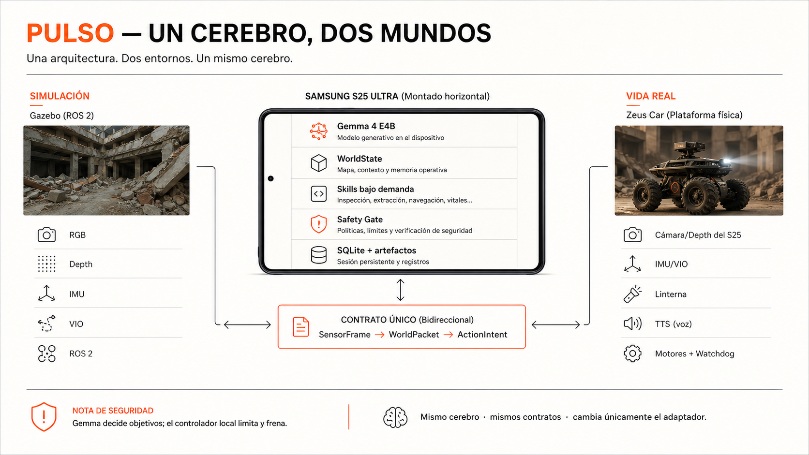
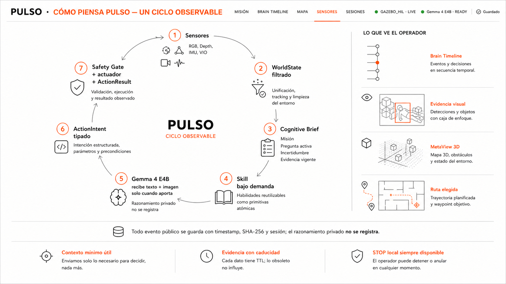
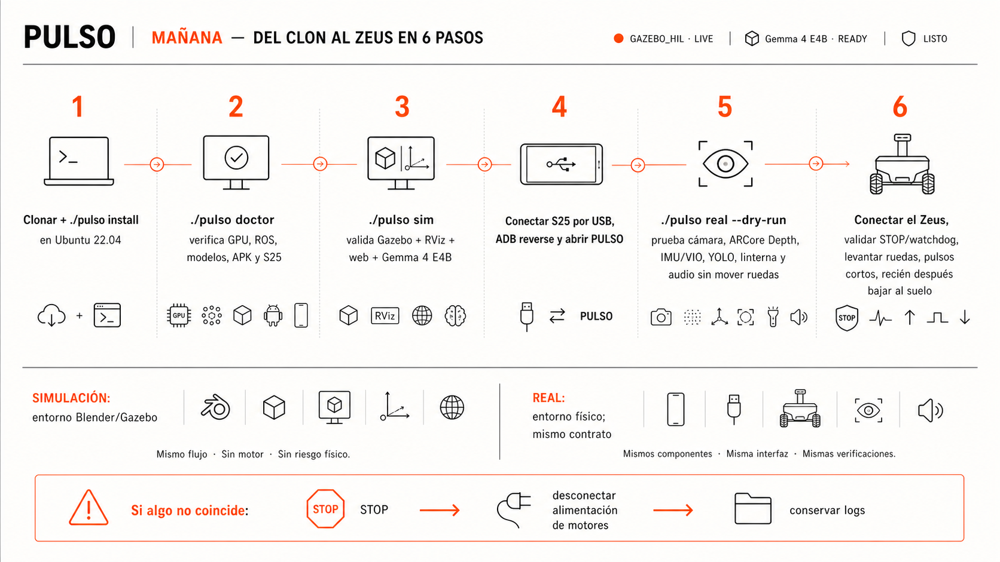
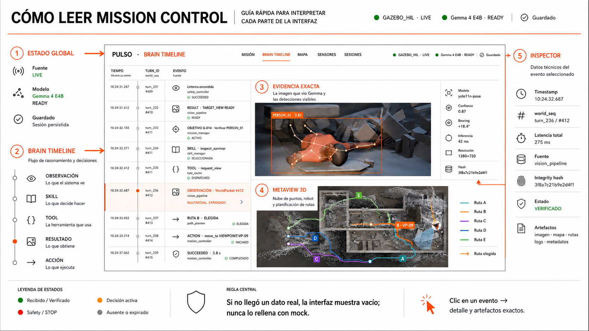

# PULSO — guía visual

Estas láminas explican la arquitectura y la operación. No son capturas de una
ejecución ni sustituyen los logs, hashes o artefactos de una sesión.

## 1. Un cerebro, dos mundos

Explica la frontera estable `SensorFrame → WorldPacket → ActionIntent`: el
adaptador cambia entre Gazebo y el S25/Zeus; el cerebro y los contratos no.

## 2. Ciclo cognitivo observable

Muestra qué contexto recibe Gemma, cómo se carga una skill bajo demanda y por
qué una acción termina siempre en un resultado observable. PULSO registra la
causalidad pública del harness, no razonamiento privado.

## 3. Secuencia segura para mañana

La prueba física empieza sin energía de motores y termina con pulsos cortos y
ruedas levantadas. Nunca se omite `doctor`, STOP o watchdog.

## 4. Cómo leer Mission Control

La interfaz no rellena ausencias: un dato inexistente o expirado se ve vacío.
Cada evento puede abrir su payload y sus artefactos exactos.

## Proveniencia

| Archivo | Fuente conceptual | SHA-256 |
| --- | --- | --- |
| `01-un-cerebro-dos-mundos.png` | `PULSO_SYSTEM_ARCHITECTURE.md` + diseño aprobado 01/02 | `5a944a9852a11ad574fd2e74967a2dd9b901014fcb8c67193a8b18c02de644b3` |
| `02-ciclo-observable.png` | `PULSO_COGNITIVE_ARCHITECTURE_V0.2.md` + diseño aprobado 03/05 | `d3c7f7906bbcb6a160cd307a3726c2606a187e45497a6ff8b48afd84f5f96506` |
| `03-manana-en-seis-pasos.png` | `PULSO_IMPLEMENTATION_RUNBOOK.md` + diseño aprobado 04/06 | `397cdae25b5b0bec3c41bd6884ac36a8ab8daa2afff8a821fb1ebe53378b98f0` |
| `04-como-leer-mission-control.png` | interfaz aprobada 02/05 | `1d17c24e6795898b92a0a26ec405a86e70907329e5ab3e6aecf9f8b60e3e7825` |

Generadas con OpenAI ImageGen el 1 de agosto de 2026. Los prompts pidieron
diagramas técnicos en español, paleta blanca/naranja PULSO, tipografía sobria,
sin métricas inventadas y con separación explícita entre simulación, hardware
real y límites de seguridad. Los PNG originales generados se preservan además
en el historial de esta tarea.
